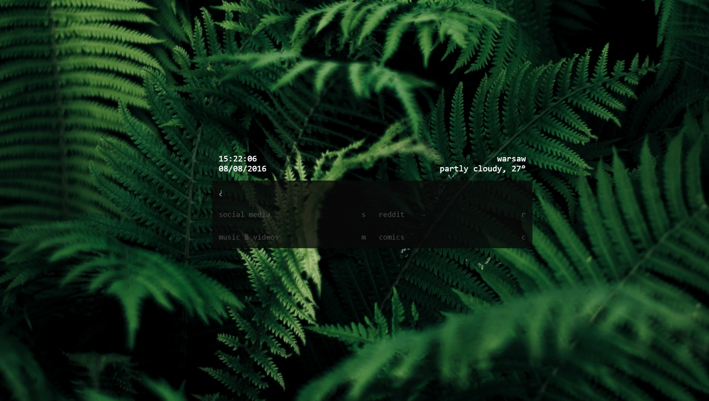

# ~start [https://lavventura.github.io/start/](LIVE)

##New tab page with powerful searchbar, bookmarks, weather, and nice image backgrounds which can replace your browser's adress bar completely.

Search bar is set to focus on page load.

In order to use the keyboard controls, you need to unfocus search bar - [TAB].

Each category is openable by keyboard and click, press escape to close all.

Press [W] to get detailed weather information for your location from Yahoo! Weather.

##Search bar 

Search bar script from [@WillEccles](https://github.com/WillEccles) allows this start page work as a complete replacement to your browser's adress bar.

Type 'help' to get complete list of commands and search engines.

##Examples:
- 'search query' navigates you to duckduckgo's result page for your search query.
- 'some.webpage.com', well, navigates to that webpage.
- 'yt [search query]' searches youtube.
- 'reddit -r startpages' navigates to [/r/startpages](https://reddit.com/r/startpages)

##Contents:
- Heavily modified version of [pschfr/start](https://github.com/pschfr/start)
- Searchbar script is taken from [WillEccles/startpage](https://github.com/WillEccles/startpage)
- Background image randomizes on page load, from [Unsplash Source](https://source.unsplash.com/) which pulls from [this collection](https://unsplash.com/collections/304263/)
- Weather is from [monkeecreate/jquery.simpleWeather](https://github.com/monkeecreate/jquery.simpleWeather)
- Keyboard navigation is thanks to [ccampbell/mousetrap](https://github.com/ccampbell/mousetrap)!

##You need extensions for most browsers to use this as your new tab page:
- [New Tab Redirect for Chrome](https://chrome.google.com/webstore/detail/new-tab-redirect/icpgjfneehieebagbmdbhnlpiopdcmna)
- [New Tab Override for Firefox](https://addons.mozilla.org/en-US/firefox/addon/new-tab-override/)
- [Custom New Tab Page for Opera](https://addons.opera.com/en/extensions/details/custom-new-tab-page/)
- Safari - just set it as your homepage in settings.

~~BTW, it's super fast. DOMContentLoaded of ~225ms (~150ms as an extension!!) :D~~

Not so sure about that as it's now poorly hacked together, but hey, who cares since it works?

But yeah, for now the code is a mess.
